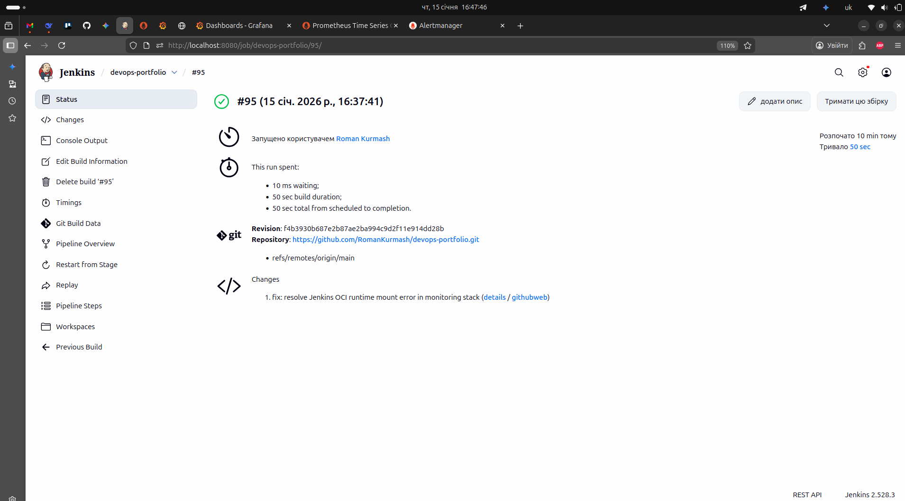
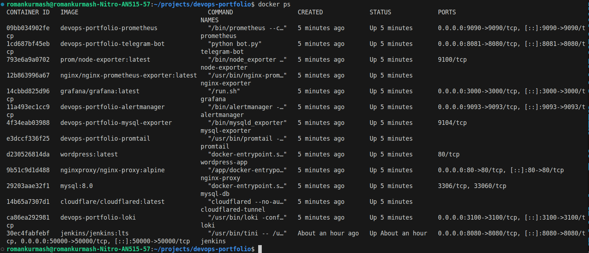
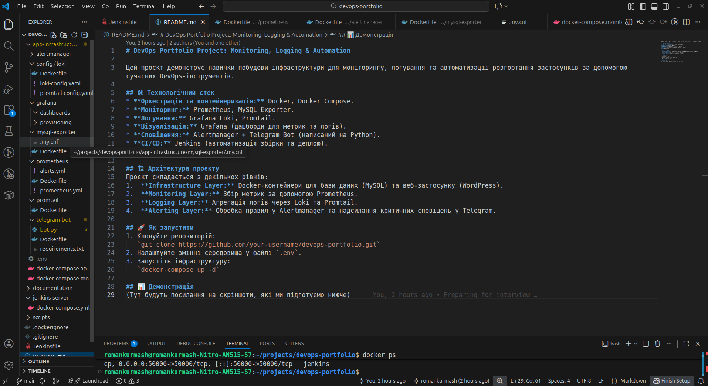
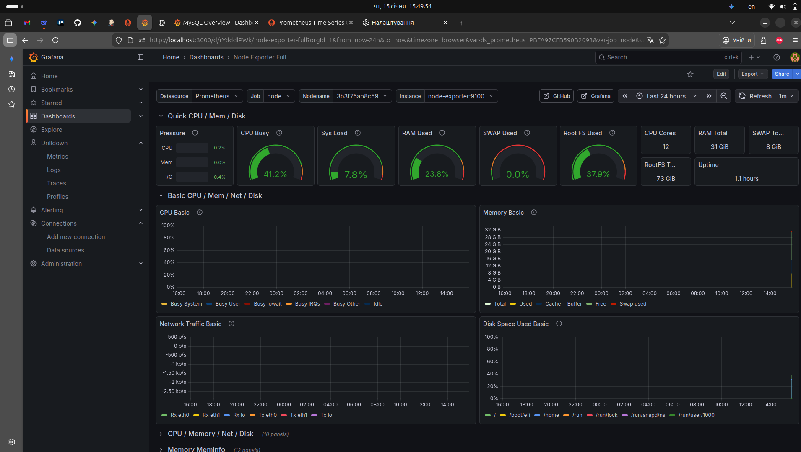
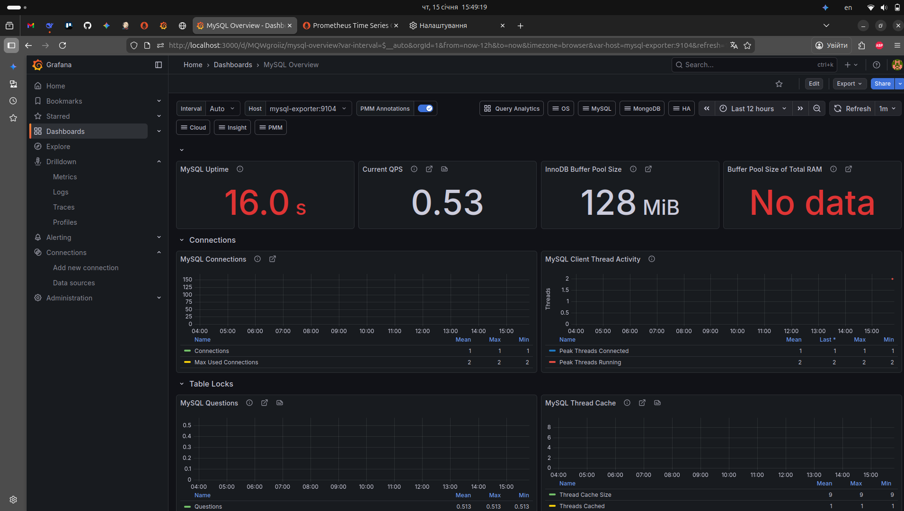
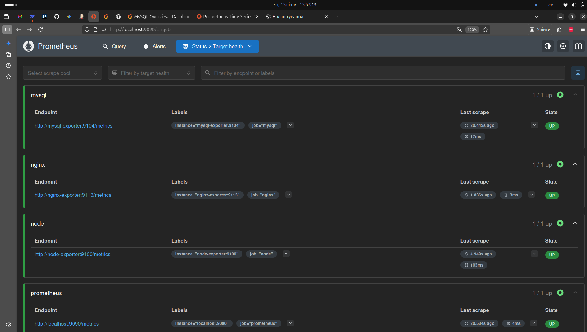
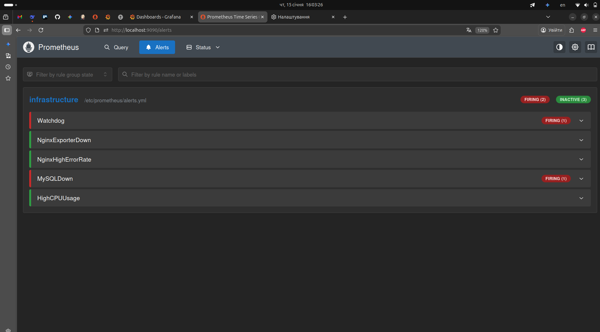
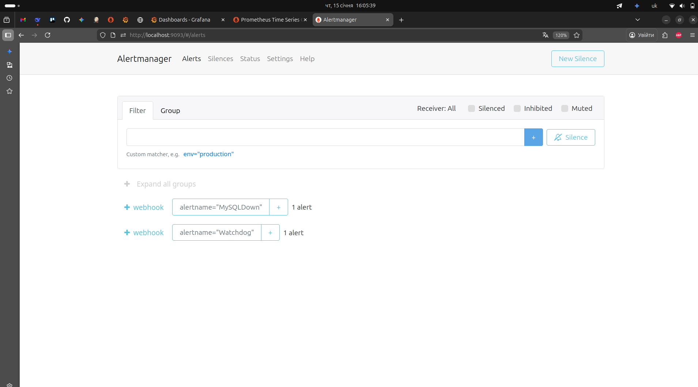
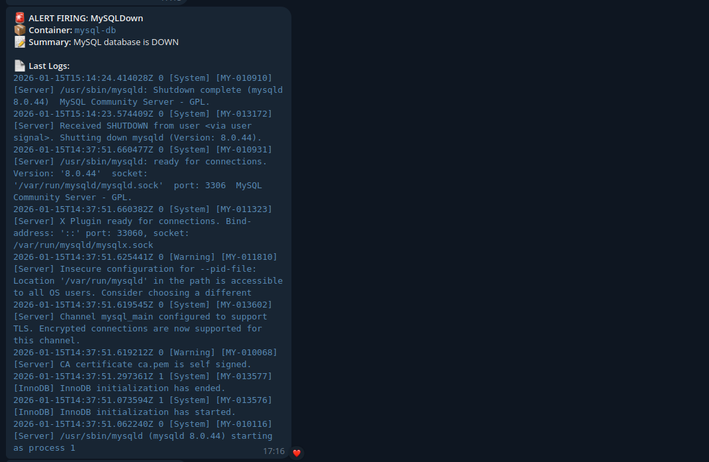
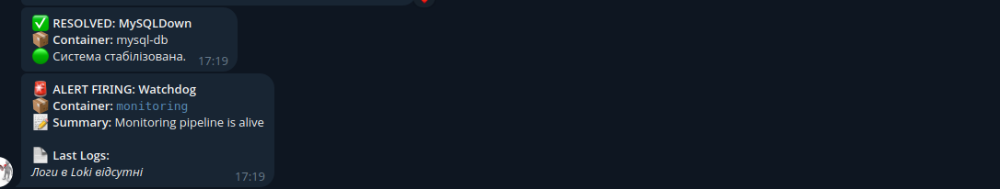

# DevOps Portfolio Project: Monitoring, Logging & Automation

Цей проєкт демонструє навички побудови інфраструктури для моніторингу, логування та автоматизації розгортання застосунків за допомогою сучасних DevOps-інструментів.

## 🛠 Технологічний стек
* **Оркестрація та контейнеризація:** Docker, Docker Compose.
* **Моніторинг:** Prometheus, MySQL Exporter.
* **Логування:** Grafana Loki, Promtail.
* **Візуалізація:** Grafana (дашборди для метрик та логів).
* **Сповіщення:** Alertmanager + Telegram Bot (написаний на Python).
* **CI/CD:** Jenkins (автоматизація збірки та деплою).
* **ОС:** Ubuntu Linux.

## 🏗 Архітектура проєкту
Проєкт складається з декількох рівнів:
1.  **Infrastructure Layer:** Docker-контейнери для бази даних (MySQL) та веб-застосунку (WordPress).
2.  **Monitoring Layer:** Збір метрик за допомогою Prometheus.
3.  **Logging Layer:** Агрегація логів через Loki та Promtail.
4.  **Alerting Layer:** Обробка правил у Alertmanager та надсилання критичних сповіщень у Telegram.

## 🚀 Як запустити
1. Клонуйте репозиторій:
   `git clone https://github.com/your-username/devops-portfolio.git`
2. Налаштуйте змінні середовища у файлі `.env`.
3. Запустіть інфраструктуру:
   `docker-compose up -d`

## 📊 Візуалізація та докази працездатності системи

У цьому розділі представлені результати роботи інфраструктури, розгорнутої на базі Acer Nitro AN515-57. Кожен етап підкріплений скріншотами з реально діючої системи.

### 1. Автоматизація та CI/CD (Jenkins & Docker)
Процес розгортання повністю автоматизований. Використання "запечених" конфігурацій дозволило досягти імутабельності інфраструктури та усунути конфлікти шляхів у Jenkins.

* **Успішний Jenkins Pipeline**:
  
  *Опис: Результат виконання білду #95. Всі етапи (Build, Deploy, Health Checks) пройдені успішно за 50 секунд.*

* **Статус контейнерів у системі**:
  
  *Опис: Підтвердження роботи 12 сервісів. Всі контейнери перебувають у статусі "Up", що свідчить про стабільність Docker-стека.*

* **Архітектура проекту в VS Code**:
  
  *Опис: Організація репозиторію з чітким розділенням інфраструктури, конфігурацій та документації.*

---

### 2. Моніторинг та Observability (Grafana & Prometheus)
Для забезпечення повної видимості процесів налаштовано збір метрик із хоста та сервісів.

* **Системні метрики (Node Exporter)**:
  
  *Опис: Моніторинг апаратних ресурсів Nitro AN515-57 (CPU, RAM, Disk) через Grafana.*

* **Моніторинг бази даних (MySQL Overview)**:
  
  *Опис: Аналітика роботи MySQL, розгорнутої у контейнері. Відображає uptime та продуктивність бази.*

* **Здоров'я цілей моніторингу**:
  
  *Опис: Сторінка Targets у Prometheus, що підтверджує успішний збір даних з усіх експортерів.*

---

### 3. Інцидент-менеджмент та Логування (Loki & Telegram)
Ключовий аспект проекту для спеціальності 125 — виявлення та реагування на відмови.

* **Активні алерти (Prometheus)**:
  
  *Опис: Стан системи під час імітації інциденту. Алерт MySQLDown перебуває у стані FIRING.*

* **Керування сповіщеннями (Alertmanager)**:
  
  *Опис: Інтерфейс керування алертами перед їх маршрутизацією у Telegram.*

* **Сповіщення про інцидент із логами Loki**:
  
  *Опис: Критичне сповіщення в Telegram. Бот автоматично додав останні рядки логів із Loki для швидкої діагностики.*

* **Відновлення системи (Status Resolved)**:
  
  *Опис: Повідомлення про автоматичне відновлення працездатності після успішного перезапуску сервісу.*