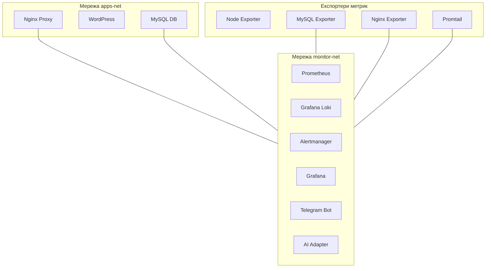

# Загальна архітектура системи моніторингу та логування

Цей документ детально описує структуру інфраструктури, мережеву взаємодію контейнерів та систему збереження даних (Volume Management).

---

## 1. Концептуальні рівні інфраструктури

Система розділена на чотири логічні рівні для забезпечення ізоляції та безпеки:

1. **Рівень додатків (Application Layer)**:
   * **WordPress**: Веб-додаток, що обслуговує користувачів.
   * **MySQL**: СУБД для збереження даних веб-додатку.
   * **Nginx Proxy**: Зворотний проксі-сервер для маршрутизації HTTP-трафіку та SSL-термінації.

2. **Рівень збору метрик (Metrics Layer)**:
   * **Prometheus**: Центральний сервер збору метрик шляхом pull-запитів.
   * **Node Exporter**: Збір метрик хост-системи (CPU, RAM, диск).
   * **MySQL Exporter**: Збір метрик продуктивності бази даних.
   * **Nginx Exporter**: Збір метрик продуктивності веб-сервера.

3. **Рівень збору логів (Logging Layer)**:
   * **Grafana Loki**: База даних для довготривалого збереження логів.
   * **Promtail**: Агент збору логів з Docker-контейнерів.

4. **Рівень сповіщень та візуалізації (Alerting & Visualization Layer)**:
   * **Grafana**: Панель візуалізації метрик і логів.
   * **Alertmanager**: Обробка та дедуплікація алертів.
   * **Telegram Bot**: Надсилання сповіщень про інциденти користувачу.

---

## 2. Мережева структура (Docker Networks)

Для ізоляції додатків від систем моніторингу створено дві окремі мережі:

* **apps-net**: Ізольована мережа для взаємодії клієнтського WordPress з базою даних MySQL.
* **monitor-net**: Мережа для компонентів моніторингу, збору логів та AI-аналізу. Експортери та проксі-сервер мають доступ до обох мереж для безпечної передачі даних.

---

## 3. Збереження даних (Volume Management)

Всі критичні компоненти використовують іменовані Docker Volumes для збереження стану при перезапуску або оновленні контейнерів:

* `mysql_data`: Збереження бази даних WordPress.
* `prometheus_data`: База даних часових рядів (TSDB) Prometheus.
* `grafana_data`: Збереження користувачів, конфігурацій та дашбордів Grafana.
* `loki_data`: Збереження індексу та чанків логів Grafana Loki.
* `jenkins_data`: Збереження конфігурацій, плагінів та історій білдів Jenkins CI.
