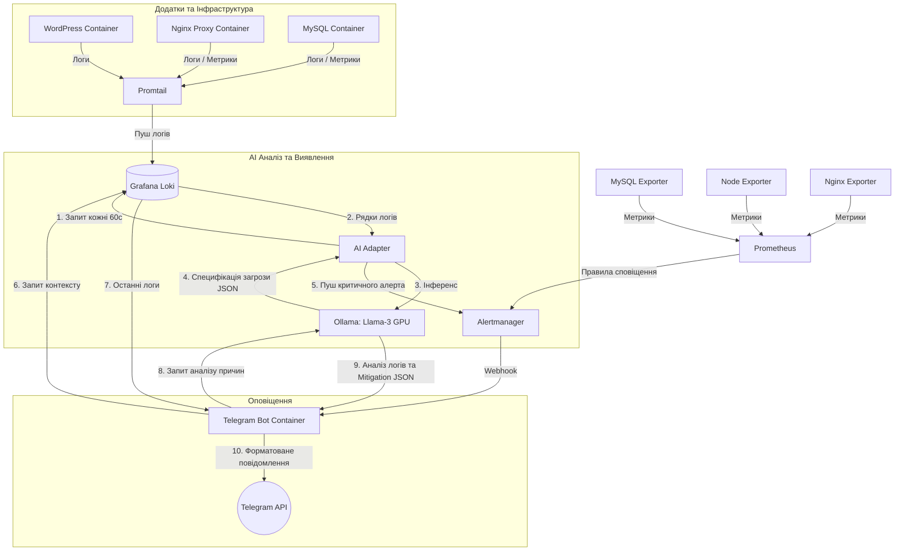

# SecOps AI Monitoring Stack Architecture

Даний документ описує архітектуру, взаємодію компонентів та роль локальної мовної моделі (LLM) у системі автоматизованого моніторингу безпеки та аналізу аномалій.

---

## 1. Схема потоку даних (Data Flow)

Система побудована на принципі реактивного моніторингу та проактивного сканування логів:

---

## 2. Компоненти системи та їх ролі

1. **Promtail**: Агент збору логів, який монтується до `/var/lib/docker/containers` хоста, автоматично зчитує логи всіх контейнерів, додає метадані (назву контейнера, сервісу) та відправляє їх у Loki.
2. **Grafana Loki**: Горизонтально масштабована база даних логів. Виступає центральним сховищем текстової інформації для всієї системи.
3. **Prometheus**: Система збору та зберігання часових рядів (метрики). Збирає метрики з експортерів (Node, MySQL, Nginx) та оцінює правила алертів (наприклад, `MySQLDown`).
4. **Alertmanager**: Обробляє алерти від Prometheus та AI-адаптера, групує їх, виконує дедуплікацію та направляє на Webhook Telegram-бота.
5. **Ollama**: Self-hosted платформа для запуску великих мовних моделей. Завдяки інтеграції з NVIDIA Container Toolkit виконує інференс моделі **Llama-3 (8B)** з апаратним прискоренням на GPU хост-машини.
6. **AI-Adapter (Python)**: Фоновий мікросервіс, який періодично робить вибірку останніх логів безпеки з Loki за допомогою LogQL, відправляє їх до Ollama для виявлення аномалій та у разі високого рівня загрози (`risk_score >= 7`) генерує алерт в Alertmanager.
7. **Telegram Bot (Python/FastAPI)**: Отримує алерти від Alertmanager. Для стандартних інфраструктурних алертів він самостійно зчитує логи з Loki, запитує аналіз у LLM та відправляє розширені результати власнику у чат.

---

## 3. Роль мовної моделі (LLM) у моніторингу

LLM (Llama-3) у цій архітектурі виконує дві критичні функції:

### А. Асинхронне виявлення загроз (Streaming Log Scanning)
AI-адаптер регулярно (щохвилини) зчитує сирі логи доступу та додатків. Модель аналізує їх на наявність:
*   Спроб SQL-ін'єкцій (SQLi)
*   Спроб віддаленого виконання команд (RCE)
*   Атак типу brute-force (перебір паролів)
*   Міжсайтового скриптингу (XSS)

На виході модель класифікує загрозу за **10 найбільш вірогідними категоріями**:
1. **SQL Injection**
2. **Remote Code Execution**
3. **Brute-force Attack**
4. **Cross-Site Scripting**
5. **Unauthorized Access**
6. **Database Connection Failure**
7. **Out of Memory Crash**
8. **High Error Rate**
9. **Service Timeout**
10. **Resource Exhaustion**

Також визначається оцінка ризику (`risk_score` від 0 до 10). Якщо оцінка перевищує `7`, створюється інцидент.

### Б. Збагачення контексту сповіщень (On-the-fly Alert Enrichment)
Коли спрацьовує стандартний алерт (наприклад, база даних MySQL не відповідає), розробнику зазвичай приходить просте повідомлення `MySQL database is DOWN`. 

Завдяки інтеграції з LLM:
1. Бот перехоплює сповіщення.
2. Робить швидкий запит до Loki для отримання останніх 10-15 рядків логів впалого контейнера.
3. Передає ці логи до Llama-3 з промптом виявити причину.
4. Модель аналізує помилки (наприклад, знаходить `Out of memory: Killed process` або `Access denied for user`) та формує:
   * **Точну ідентифікацію проблеми** (наприклад, `Out of Memory Crash`).
   * **Розширене резюме (Summary)** людською мовою, де пояснює, чому це сталося.
   * **Рекомендації (Mitigation Steps)** (наприклад, збільшити ліміт пам'яті в compose-файлі або перевірити права користувача бд).

Це суттєво скорочує час на розслідування інцидентів (MTTR - Mean Time to Resolution), оскільки інженер отримує готову діагностику та інструкції з ліквідації проблеми безпосередньо у месенджері.
